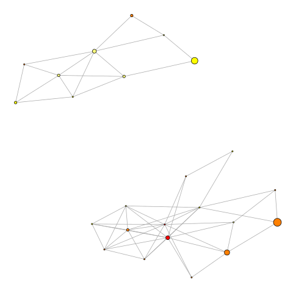

## spRspace
This directory will hold some R scripts to perform the steps in the SPRspace pipeline.
The main focus will be on BEAST time-calibrated trees.

- [x] read BEAST trees;

- [ ] read MrBayes trees;

- [x] sort trees and get 95% set;

- [x] create SPR matrix;

- [x] plot graphs;

- [x] export graphs;

- [ ] compute commute-time statistics;

- [ ] compute the topological Gelman-Rubin-like measure 

